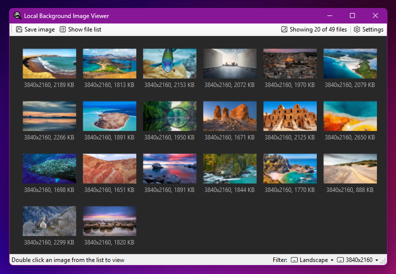

# LocalWallpaperViewer

**Discover, view, and save locally stored wallpapers from various system services.**

## Description

A small utility designed for Windows users to easily access and manage images stored by services like **Spotlight** and the **IrisService**.

The application automatically locates and monitors the default folders for these services. All folder paths and filtering options can be configured in the Settings menu.

## Screenshot

## How to Use

### 1. Initial Setup (Settings Menu)

* **Configure Folders:** Open the Settings menu to define or adjust the folders the application should scan. Folders that contain images will be enabled by default and show a file count indicator next to the Settings icon.
* **Set Quick Save Location:** Define a pre-selected folder in the Settings menu for quickly saving wallpapers you like.

### 2. Viewing and Filtering

* **Switch Views:** Toggle between two main display modes: a **Thumbnails** view and a hierarchical **File List** view (showing files organized by their source folder).
* **Filter Images:** In the Thumbnail View, images can be filtered by their resolution and orientation.
* **Preview:** Double-click any thumbnail or list item to open the image in a  full-size preview window.

### 3. Saving Wallpapers

* **Context Menu:** Right-clicking any wallpaper brings up a context menu with options to:
    * **Open in Preview:** Open the image in the preview window.
    * **Quick Save:** Instantly save the image to your pre-defined Quick Save folder.
    * **Save to...:** Choose a specific location to save the image.
    * **Open image folder:** Open the folder where the image is stored.

## License

Copyright (c) 2025 Narfel.

Usage is provided under the GNU License. See [LICENSE](LICENSE) for the full details.